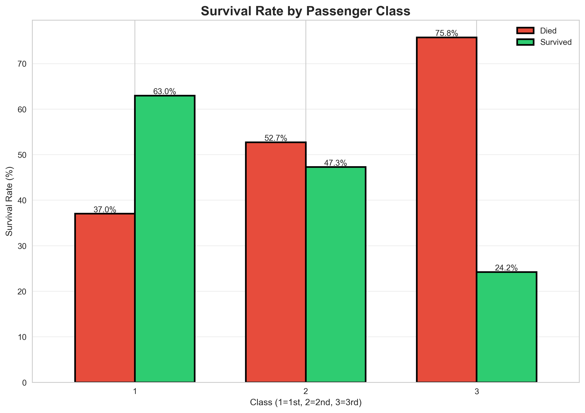

# PRODIGY_DS_02
Titanic Dataset EDA - Prodigy InfoTech Task 2

# 🚢 PRODIGY_DS_02: Titanic Survival Analysis ✅ COMPLETE

## 🔥 KEY BUSINESS INSIGHTS
| Factor | Survival Rate | Business Impact |
|--------|---------------|-----------------|
| **Women** | **74%** | 3.9x > Men |
| **1st Class** | **63%** | 2.6x > 3rd Class |
| **Family Size 4** | **72%** | **Optimal** |
| **Cabin Recorded** | **67%** | Wealth indicator |

## 📊 Professional Visualizations

## 🛠️ Technical Stack
**Pandas** • **Seaborn** • **Matplotlib** • **Feature Engineering** • **EDA**

---
**Rushikesh** | Prodigy InfoTech Data Science Intern  
**Completed:** Jan 8, 2026 | **GitHub:** 7a72147
